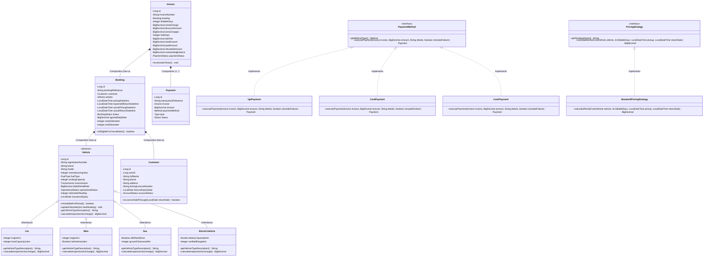

# FleetDesk — Object-Oriented UML Class Diagram

## Comprehensive Domain Class Diagram

```mermaid
classDiagram
    class Vehicle {
        <<abstract>>
        -Long id
        -String registrationNumber
        -String brand
        -String model
        -Integer manufacturingYear
        -FuelType fuelType
        -Integer seatingCapacity
        -Transmission transmission
        -BigDecimal dailyRentalRate
        -OperationalStatus operationalStatus
        -Integer odometerReading
        -LocalDate insuranceExpiry
        +isAvailableForRental() boolean
        +updateOdometer(int newReading) void
        +getVehicleTypeDescription()* String
        +calculateInspectionSurcharge()* BigDecimal
    }

    class Car {
        -Integer engineCc
        -Integer bootCapacityLiters
        +getVehicleTypeDescription() String
        +calculateInspectionSurcharge() BigDecimal
    }

    class Bike {
        -Integer engineCc
        -Boolean helmetIncluded
        +getVehicleTypeDescription() String
        +calculateInspectionSurcharge() BigDecimal
    }

    class Suv {
        -Boolean allWheelDrive
        -Integer groundClearanceMm
        +getVehicleTypeDescription() String
        +calculateInspectionSurcharge() BigDecimal
    }

    class ElectricVehicle {
        -Double batteryCapacityKwh
        -Integer certifiedRangeKm
        +getVehicleTypeDescription() String
        +calculateInspectionSurcharge() BigDecimal
    }

    class Customer {
        -Long id
        -Long userId
        -String fullName
        -String phone
        -String address
        -String drivingLicenceNumber
        -LocalDate licenceExpiryDate
        -AccountStatus accountStatus
        +isLicenceValidThrough(LocalDate returnDate) boolean
    }

    class Booking {
        -Long id
        -String bookingReference
        -Customer customer
        -Vehicle vehicle
        -LocalDateTime pickupDatetime
        -LocalDateTime expectedReturnDatetime
        -LocalDateTime actualPickupDatetime
        -LocalDateTime actualReturnDatetime
        -BookingStatus status
        -BigDecimal agreedDailyRate
        -Integer startOdometer
        -Integer endOdometer
        +isEligibleForCancellation() boolean
    }

    class Invoice {
        -Long id
        -String invoiceNumber
        -Booking booking
        -Integer billableDays
        -BigDecimal rentalCharge
        -BigDecimal discountAmount
        -BigDecimal extraCharges
        -Integer lateDays
        -BigDecimal lateFee
        -BigDecimal totalAmount
        -BigDecimal paidAmount
        -BigDecimal refundedAmount
        -BigDecimal outstandingBalance
        -PaymentStatus paymentStatus
        +recalculateTotals() void
    }

    class Payment {
        -Long id
        -String transactionReference
        -Invoice invoice
        -BigDecimal amount
        -Method paymentMethod
        -Type type
        -Status status
    }

    class PaymentMethod {
        <<interface>>
        +getMethodType() Method
        +executePayment(Invoice invoice, BigDecimal amount, String details, boolean simulateFailure) Payment
    }

    class UpiPayment {
        +executePayment(Invoice invoice, BigDecimal amount, String details, boolean simulateFailure) Payment
    }

    class CardPayment {
        +executePayment(Invoice invoice, BigDecimal amount, String details, boolean simulateFailure) Payment
    }

    class CashPayment {
        +executePayment(Invoice invoice, BigDecimal amount, String details, boolean simulateFailure) Payment
    }

    class PricingStrategy {
        <<interface>>
        +getStrategyName() String
        +calculateRentalCost(Vehicle vehicle, int billableDays, LocalDateTime pickup, LocalDateTime returnDate) BigDecimal
    }

    class StandardPricingStrategy {
        +calculateRentalCost(Vehicle vehicle, int billableDays, LocalDateTime pickup, LocalDateTime returnDate) BigDecimal
    }

    Vehicle <|-- Car : Inheritance
    Vehicle <|-- Bike : Inheritance
    Vehicle <|-- Suv : Inheritance
    Vehicle <|-- ElectricVehicle : Inheritance

    PaymentMethod <|.. UpiPayment : Implements
    PaymentMethod <|.. CardPayment : Implements
    PaymentMethod <|.. CashPayment : Implements

    PricingStrategy <|.. StandardPricingStrategy : Implements

    Booking *-- Customer : Composition (has-a)
    Booking *-- Vehicle : Composition (has-a)
    Invoice *-- Booking : Composition (has-a)
    Invoice *-- Payment : Composition (1..*)
```
